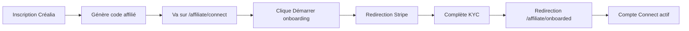
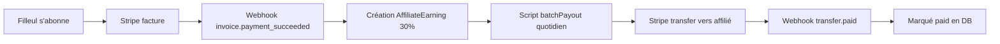

# 💳 Stripe Connect - Guide de Configuration Créalia

## 📋 Table des matières

1. [Introduction](#introduction)
2. [Prérequis](#prérequis)
3. [Configuration Stripe](#configuration-stripe)
4. [Webhooks](#webhooks)
5. [Tests](#tests)
6. [Production](#production)

---

## Introduction

Ce guide explique comment configurer **Stripe Connect Express** pour le système d'affiliation Créalia. Stripe Connect permet aux affiliés de recevoir des paiements automatiques directement sur leur compte bancaire.

---

## Prérequis

- Compte Stripe (gratuit) : [dashboard.stripe.com](https://dashboard.stripe.com)
- Accès aux paramètres Stripe
- Variables d'environnement configurées

---

## Configuration Stripe

### 1. Activer Stripe Connect

1. Connectez-vous à votre Dashboard Stripe
2. Allez dans **Connect** → **Settings**
3. Cliquez sur **Get started**
4. Choisissez **Express** (recommandé pour Créalia)
5. Activez **Transfers** capability

### 2. Récupérer les clés

#### Clé secrète (`STRIPE_SECRET_KEY`)

1. Allez dans **Développeurs** → **Clés API**
2. Mode **Test** : copiez `sk_test_...`
3. Mode **Live** : copiez `sk_live_...`

#### Client ID Connect (`STRIPE_CONNECT_CLIENT_ID`)

1. Allez dans **Connect** → **Settings**
2. Copiez le **Client ID** (format: `ca_...`)

### 3. Configurer les redirections

Dans **Connect** → **Settings** → **Branding** :

- **Return URL** : `https://votresite.com/affiliate/onboarded`
- **Refresh URL** : `https://votresite.com/affiliate/connect?refresh=true`

---

## Webhooks

### 1. Créer un endpoint webhook

1. Allez dans **Développeurs** → **Webhooks**
2. Cliquez sur **Add endpoint**
3. URL : `https://votresite.com/api/stripe-webhook`

### 2. Sélectionner les événements

Cochez ces événements :

✅ **checkout.session.completed**  
Déclenché quand un utilisateur finalise son abonnement

✅ **invoice.payment_succeeded**  
Déclenché à chaque paiement récurrent (pour calculer la commission)

✅ **account.updated**  
Déclenché quand le compte Connect d'un affilié est mis à jour

✅ **transfer.paid**  
Déclenché quand un transfert vers un affilié est effectué

✅ **payout.paid** (optionnel)  
Déclenché quand Stripe effectue un virement vers le compte bancaire

### 3. Récupérer le Signing Secret

1. Après avoir créé le webhook, cliquez dessus
2. Copiez le **Signing secret** (format: `whsec_...`)
3. Ajoutez-le dans `.env.local` :
   ```bash
   STRIPE_WEBHOOK_SECRET="whsec_..."
   ```

---

## Tests

### 1. Mode Test (développement)

Utilisez les clés de test Stripe :
```bash
STRIPE_SECRET_KEY="sk_test_..."
```

### 2. Tester les webhooks localement

#### a) Installer Stripe CLI

```bash
# macOS
brew install stripe/stripe-cli/stripe

# Linux
wget https://github.com/stripe/stripe-cli/releases/latest/download/stripe_X.X.X_linux_x86_64.tar.gz
tar -xvf stripe_X.X.X_linux_x86_64.tar.gz
sudo mv stripe /usr/local/bin
```

#### b) Authentifier

```bash
stripe login
```

#### c) Forwarder les webhooks localement

```bash
stripe listen --forward-to localhost:3000/api/stripe-webhook
```

#### d) Déclencher des événements de test

```bash
# Tester checkout.session.completed
stripe trigger checkout.session.completed

# Tester invoice.payment_succeeded
stripe trigger invoice.payment_succeeded

# Tester account.updated
stripe trigger account.updated
```

### 3. Mode MOCK (sans Stripe)

Pour développer sans appeler Stripe :

```bash
MOCK_STRIPE=true
```

Les transferts seront simulés avec des IDs mock :
```
mock_tr_1234567890
```

---

## Production

### 1. Passer en mode Live

1. Dans Dashboard Stripe, basculez vers **Live mode** (toggle en haut à droite)
2. Générez de nouvelles clés Live :
   - `sk_live_...`
   - `whsec_live_...`
3. Mettez à jour les variables d'environnement sur Vercel

### 2. Configurer le webhook en Live

1. Allez dans **Webhooks** → mode **Live**
2. Créez un nouveau endpoint : `https://votresite.com/api/stripe-webhook`
3. Sélectionnez les mêmes événements qu'en test
4. Copiez le nouveau **Signing secret**

### 3. Validation du compte Stripe

Pour accepter des paiements en production, Stripe demande :

- ✅ Informations sur votre entreprise
- ✅ Vérification d'identité (KYC)
- ✅ Informations bancaires
- ✅ Acceptation des conditions Stripe

### 4. Configuration des frais

#### Frais de plateforme (optionnel)

Si vous souhaitez prélever des frais supplémentaires :

```typescript
await stripe.transfers.create({
  amount: Math.round(total * 100),
  currency: "eur",
  destination: affiliate.stripeAccountId,
  application_fee_amount: Math.round(total * 10), // 10% de frais plateforme
});
```

⚠️ **Note** : Dans le système actuel, l'affilié reçoit 100% des 30% calculés.

---

## Flux complet

### Pour l'affilié



### Pour le paiement



---

## Sécurité

### 1. Vérification des signatures webhook

Le code vérifie automatiquement la signature :

```typescript
const event = stripe.webhooks.constructEvent(
  body,
  signature,
  webhookSecret
);
```

### 2. Protection des clés

- ❌ **Ne jamais** commiter les clés dans Git
- ✅ Utiliser `.env.local` en développement
- ✅ Utiliser les secrets Vercel en production

### 3. HTTPS obligatoire

Les webhooks Stripe nécessitent HTTPS en production.

---

## Troubleshooting

### Erreur : "Invalid signature"

**Cause** : La signature du webhook ne correspond pas.

**Solution** :
1. Vérifier que `STRIPE_WEBHOOK_SECRET` est correct
2. Tester avec Stripe CLI
3. Vérifier que le body n'est pas parsé avant vérification

### Erreur : "Transfer failed - Insufficient funds"

**Cause** : La plateforme n'a pas assez de fonds disponibles.

**Solution** :
1. Vérifier le solde dans **Balance** → **Available**
2. Attendre que les fonds soient disponibles (généralement 2-7 jours après un paiement)

### Erreur : "Account not found"

**Cause** : `stripeAccountId` incorrect ou compte supprimé.

**Solution** :
1. Vérifier `stripeAccountId` dans la base de données
2. Vérifier sur Stripe Dashboard → **Connect** → **Accounts**

---

## Resources

- [Documentation Stripe Connect](https://stripe.com/docs/connect)
- [Stripe CLI](https://stripe.com/docs/stripe-cli)
- [Webhooks Stripe](https://stripe.com/docs/webhooks)
- [Express Accounts](https://stripe.com/docs/connect/express-accounts)

---

**✅ Configuration terminée ! Le système de paiement est maintenant opérationnel.**

