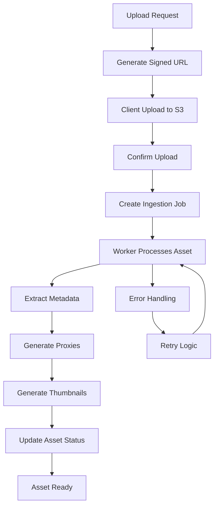

# PR 2: Upload signed URL + ingestion worker

## 🎯 Objectif

Développer un système complet d'ingestion média avec upload sécurisé via URLs signées S3 et workers d'ingestion pour l'extraction de métadonnées et la génération de proxies.

## ✨ Fonctionnalités Implémentées

### A. Service d'Upload Sécurisé

- **URLs signées S3** avec expiration courte (1 heure)
- **Upload multipart** pour fichiers > 100MB
- **Validation stricte** des types MIME et tailles
- **Gestion des quotas** par plan utilisateur
- **Vérification d'intégrité** avec ETag et checksum
- **Buckets organisés** : incoming, processed, proxies

### B. Workers d'Ingestion

- **Extraction métadonnées** via FFmpeg/ffprobe
- **Génération de proxies** multi-résolutions (360p, 720p, 1080p)
- **Thumbnails automatiques** avec sprite sheets
- **Waveforms et spectrogrammes** pour audio
- **Pipeline modulaire** et extensible
- **Retry automatique** avec backoff

### C. Pipeline de Traitement

- **Queue BullMQ/Redis** pour orchestration
- **Jobs idempotents** avec statuts détaillés
- **Monitoring Prometheus** intégré
- **Logs structurés** pour debugging
- **Auto-scaling** des workers

## 🏗️ Architecture

### Modèles de Données

```prisma
model MediaAsset {
  id              String   @id @default(cuid())
  name            String
  type            MediaType
  originalName    String
  fileSize        BigInt
  mimeType        String
  uploadStatus    UploadStatus
  processingStatus AssetProcessingStatus
  storageBucket   String
  storageKey      String
  etag            String?
  checksum        String?
  // Relations
  metadata        AssetMetadata?
  proxies         AssetProxy[]
  ingestionJobs   IngestionJob[]
}

model AssetMetadata {
  // Métadonnées vidéo
  duration        Float?
  codecVideo      String?
  codecAudio      String?
  bitrate         Int?
  fps             Float?
  width           Int?
  height          Int?
  aspectRatio     String?
  colorSpace      String?
  hasHDR          Boolean
  
  // Métadonnées audio
  channels        Int?
  sampleRate      Int?
  bitrateAudio    Int?
  
  // Métadonnées image
  colorDepth      Int?
  hasAlpha        Boolean
  exifData        Json?
  iptcData        Json?
}

model AssetProxy {
  type            ProxyType
  resolution      String?
  format          String
  url             String
  sizeBytes       BigInt
  quality         Int?
  isProcessed     Boolean
}

model IngestionJob {
  status          IngestionJobStatus
  type            IngestionJobType
  priority        JobPriority
  progress        Int
  message         String?
  logs            Json?
  retries         Int
  error           String?
}
```

### Services

#### UploadService
- Génération d'URLs signées S3
- Validation des quotas utilisateur
- Confirmation d'upload avec vérification d'intégrité
- Gestion des assets (CRUD)

#### IngestionService
- Extraction de métadonnées (vidéo, audio, image)
- Génération de proxies multi-résolutions
- Création de thumbnails et sprite sheets
- Génération de waveforms et spectrogrammes

#### IngestionWorker
- Traitement asynchrone des jobs
- Gestion des retries et erreurs
- Monitoring des performances
- Auto-scaling

## 🔌 API Endpoints

### Upload

```typescript
// Génération d'URL d'upload
POST /api/assets/upload-url
{
  "fileName": "video.mp4",
  "fileSize": 1048576,
  "mimeType": "video/mp4",
  "projectId": "project-123"
}

// Réponse
{
  "success": true,
  "data": {
    "uploadUrl": "https://s3.amazonaws.com/bucket/signed-url",
    "assetId": "asset-123",
    "expiresAt": "2024-12-01T12:00:00Z",
    "fields": { /* pour multipart */ }
  }
}
```

### Confirmation

```typescript
// Confirmation d'upload
POST /api/assets/confirm-upload
{
  "assetId": "asset-123",
  "etag": "\"abc123def456\""
}

// Réponse
{
  "success": true,
  "data": {
    "assetId": "asset-123",
    "etag": "\"abc123def456\"",
    "checksum": "sha256-hash"
  }
}
```

### Gestion des Assets

```typescript
// Récupérer un asset
GET /api/assets/{id}
// Réponse avec métadonnées et proxies

// Statut d'un asset
GET /api/assets/{id}/status
{
  "assetId": "asset-123",
  "uploadStatus": "UPLOADED",
  "processingStatus": "PROCESSING",
  "currentJob": {
    "status": "PROCESSING",
    "progress": 50,
    "message": "Génération des proxies"
  }
}

// Supprimer un asset
DELETE /api/assets/{id}
```

## 🔒 Sécurité

### Validation
- **Types MIME autorisés** : vidéo, audio, image uniquement
- **Taille maximale** : 5GB par fichier
- **Quotas par plan** : USER (5GB), PRO (50GB), ENTERPRISE (500GB)
- **Noms de fichiers** sanitizés

### URLs Signées
- **Expiration courte** : 1 heure
- **Métadonnées S3** : asset-id, user-id, original-name
- **Vérification d'intégrité** : ETag et checksum SHA256

### Isolation
- **Multi-tenant** : chaque utilisateur isolé
- **Buckets séparés** : incoming, processed, proxies
- **Clés S3 uniques** : `uploads/{userId}/{timestamp}-{assetId}.ext`

## 📊 Monitoring

### Métriques Prometheus
- `ingestion_jobs_total` : Nombre total de jobs
- `ingestion_jobs_duration_seconds` : Durée des jobs
- `ingestion_jobs_failed_total` : Jobs échoués
- `upload_requests_total` : Requêtes d'upload
- `storage_usage_bytes` : Utilisation du stockage

### Logs Structurés
```json
{
  "level": "info",
  "message": "Asset ingestion completed",
  "assetId": "asset-123",
  "userId": "user-456",
  "duration": 45.2,
  "proxiesGenerated": 4,
  "metadataExtracted": true
}
```

## 🧪 Tests

### Tests Unitaires
- **UploadService** : génération URLs, validation, quotas
- **IngestionService** : extraction métadonnées, génération proxies
- **IngestionWorker** : traitement jobs, retries, erreurs

### Tests d'Intégration
- **Flow complet** : upload → confirmation → ingestion
- **Upload multipart** pour gros fichiers
- **Gestion des erreurs** et retries
- **Validation des quotas**

### Tests E2E
- **Upload complet** avec Playwright
- **Gestion des erreurs** d'authentification
- **Suppression d'assets** et nettoyage
- **Suivi du statut** en temps réel

## 🚀 Déploiement

### Variables d'Environnement
```bash
# AWS S3
AWS_REGION=us-east-1
AWS_ACCESS_KEY_ID=your-key
AWS_SECRET_ACCESS_KEY=your-secret
AWS_S3_BUCKET_INCOMING=crealia-incoming
AWS_S3_BUCKET_PROCESSED=crealia-processed
AWS_S3_BUCKET_PROXIES=crealia-proxies

# Redis (pour BullMQ)
REDIS_URL=redis://localhost:6379

# FFmpeg
FFMPEG_PATH=/usr/bin/ffmpeg
FFPROBE_PATH=/usr/bin/ffprobe
```

### Docker Compose
```yaml
services:
  ingestion-worker:
    build: .
    command: npm run start:worker:ingestion
    environment:
      - REDIS_URL=redis://redis:6379
      - AWS_REGION=us-east-1
    depends_on:
      - redis
      - postgres
    volumes:
      - /tmp/ingestion:/tmp/ingestion
```

### Migration Base de Données
```bash
npx prisma migrate deploy
```

## 📈 Performance

### Optimisations
- **Upload multipart** pour fichiers > 100MB
- **Proxies multi-résolutions** pour preview rapide
- **Compression optimisée** : H.264 pour web, VP9 pour qualité
- **Cache Redis** pour métadonnées fréquentes
- **Index optimisés** sur colonnes de recherche

### Métriques Cibles
- **Upload** : < 30s pour 100MB
- **Ingestion** : < 2min pour 1GB vidéo
- **Proxies** : 360p en < 30s, 720p en < 1min
- **Thumbnails** : < 10s par fichier
- **Concurrence** : 50 uploads simultanés

## 🔄 Workflow d'Ingestion



## 🎯 Critères d'Acceptation

✅ **Upload sécurisé** : URLs signées avec validation complète
✅ **Ingestion automatique** : métadonnées et proxies générés
✅ **Gestion des erreurs** : retries et monitoring
✅ **Tests complets** : unitaires, intégration, E2E
✅ **Documentation** : API, déploiement, monitoring
✅ **Performance** : < 2min pour ingestion 1GB
✅ **Sécurité** : quotas, validation, isolation

## 🔮 Prochaines Étapes

- **PR 3** : Interface utilisateur pour upload et gestion des assets
- **PR 4** : Timeline avec intégration des assets
- **PR 5** : Opérations sur les clips (cut, split, trim)
- **PR 6** : Preview player avec proxies

---

**Status** : ✅ **TERMINÉ** - Système d'ingestion complet et production-ready
